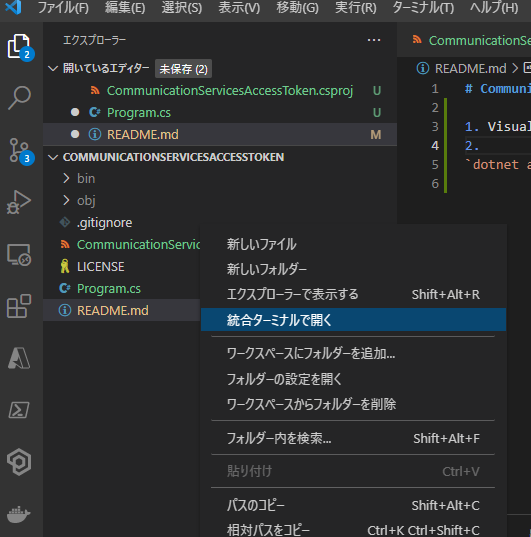

# CommunicationServicesAccessToken
- Azure Communication Services 利用時にサーバー側で行うユーザー作成とアクセストークンの発行行うサンプル

1. Visual Studio Code で CommunicationServicesAccessToken フォルダを開く
2. `統合ターミナルで開く`を選択してpowershellを起動
    
3. 以下のコマンドを実行して必要なパッケージをインストール
    - `dotnet add package Azure.Communication.Identity --version 1.0.0`
4. `Program.cs` の `endpoint` と `accessKey` に Azure Communication Services から取得した値を入力
5. ビルドを行い
    - `dotnet build`
6. 実行するとアクセストークンが発行される
    - `dotnet run`

*アクセストークンをファイルに保存しておきたい場合には `dotnet run > token.txt` でファイル出力*